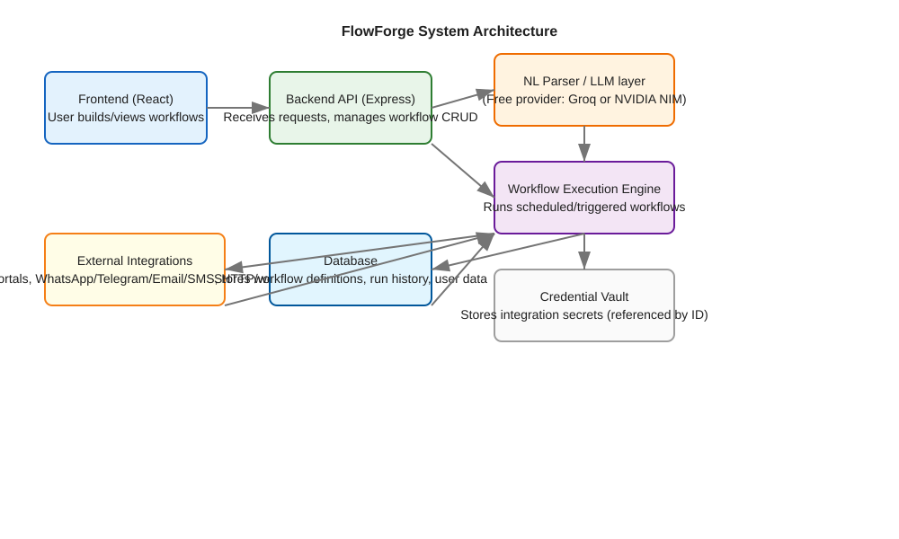

# FlowForge — turn plain-English requests into automated workflows.

FlowForge is a platform that allows users to automate tasks by describing them in natural language. The system parses the request, extracts the necessary components (trigger, source, conditions, action), and generates a structured workflow that can be executed automatically.

## Problem it solves
Many users want to automate repetitive tasks but lack the technical skills to set up complex integrations and scheduling. FlowForge bridges this gap by converting plain English into actionable workflows.

## Architecture

## Request-to-Execution Flow

## Branch structure
- `main` — Contains shared documentation, architecture diagrams, and configuration files.
- `frontend` — HTML/CSS/JavaScript application for building and viewing workflows.
- `backend` — Django REST API for handling workflow CRUD, NL parsing, and execution.

## Local setup instructions

### Backend (Django)
1. Checkout the backend branch: `git checkout backend`
2. Create a virtual environment (optional but recommended): `python -m venv venv`
3. Activate the virtual environment:
   - On macOS/Linux: `source venv/bin/activate`
   - On Windows: `venv\Scripts\activate`
4. Install dependencies: `pip install -r requirements.txt`
   - If `requirements.txt` does not exist, create one with: `Django==4.2.0`
5. Copy `.env.example` to `.env` and fill in the required values (never commit real `.env`).
6. Apply migrations: `python manage.py makemigrations` and `python manage.py migrate`
7. Create a superuser (for Django admin): `python manage.py createsuperuser`
8. Start the development server: `python manage.py runserver`
   - The API will be available at `http://localhost:8000`.

### Frontend (HTML/CSS/JS)
1. Checkout the frontend branch: `git checkout frontend`
2. Open `src/index.html` in your browser, or use a simple development server:
   - Install `serve` if you don't have it: `npm install -g serve`
   - Run: `serve src`
   - Then open your browser to `http://localhost:3000` (or the port shown in the terminal).

## Tech stack
- **Frontend**: HTML5, CSS3, JavaScript (ES6+)
- **Backend**: Python, Django REST Framework
- **Database**: SQLite (for development), PostgreSQL (for production)
- **NL Parser**: Rule-based natural language parser (planned upgrade to free LLM providers like Groq or NVIDIA NIM)
- **Execution Engine**: Simulated execution engine with realistic steps (planned upgrade to actual execution with external service integrations)
- **Credential Vault**: Encrypted storage for API keys and secrets using Fernet symmetric encryption
- **Others**: Docker (optional), JWT for authentication (planned)

## Project Phases
The project is divided into the following phases:

1. **Phase 1: Project Setup and Scaffolding** (Completed)
   - Repository initialization with LICENSE
   - Creation of three branches: main, frontend, backend
   - Basic README and documentation
   - Initial architecture and flow diagrams
   - Frontend: Basic HTML/CSS/JS workflow builder UI
   - Backend: Django project with workflows app, models, and initial services

2. **Phase 2: Core Functionality Implementation** (Completed)
   - Frontend: Connected to backend API for parsing and saving workflows
   - Backend: Implemented rule-based NL parser for extracting workflow components from natural language
   - Backend: Implemented simulated execution engine that runs workflows with realistic steps and mock data
   - Backend: Implemented credential vault with encryption for storing API keys and secrets
   - Backend: Added credential management endpoints (CRUD operations)
   - Frontend: Display workflow list, detail views, and run history (planned for next iteration)

3. **Phase 3: Integration and Advanced Features** (Planned)
   - Frontend: Workflow visualizer (node-based or flowchart)
   - Backend: Support for various triggers (schedule, webhook, manual)
   - Backend: Integration with external services (ERP, WhatsApp/Telegram/Email/SMS, webhooks)
   - Backend: Add authentication and authorization (JWT)
   - Frontend: User authentication and personal workflow management

4. **Phase 4: Testing, Deployment, and Documentation** (Planned)
   - Writing unit and integration tests
   - Setting up CI/CD pipeline
   - Dockerizing the application
   - Comprehensive user and developer documentation
   - Performance optimization and security audits

## License
This project is licensed under the MIT License - see the [LICENSE](LICENSE) file for details.

## Status Tracking
Detailed project status and phase progress are tracked in the `status/ProjectPlan.md` file.
